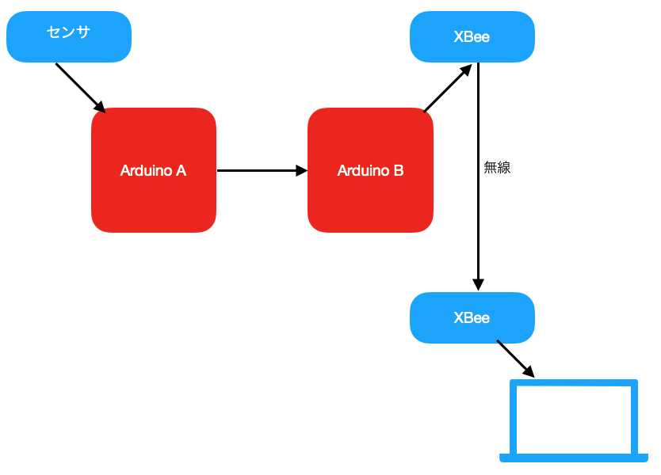
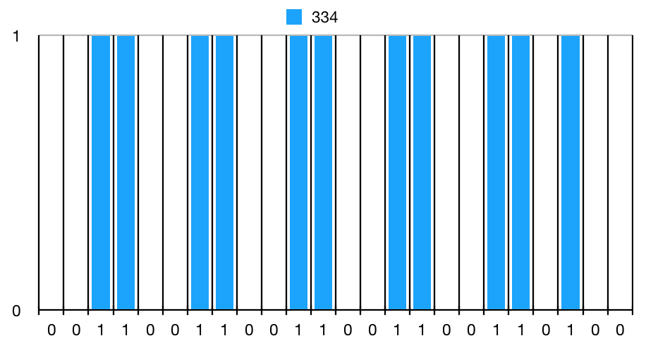
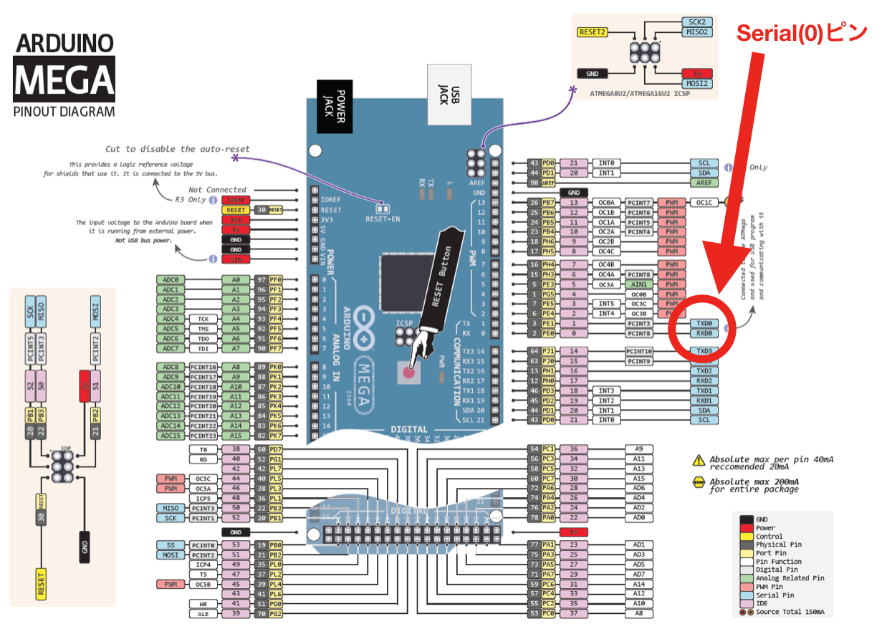
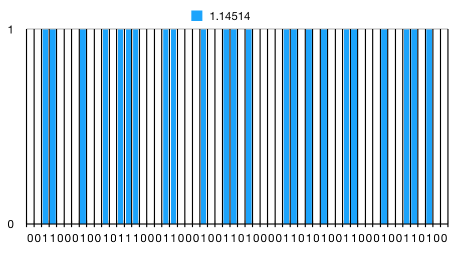
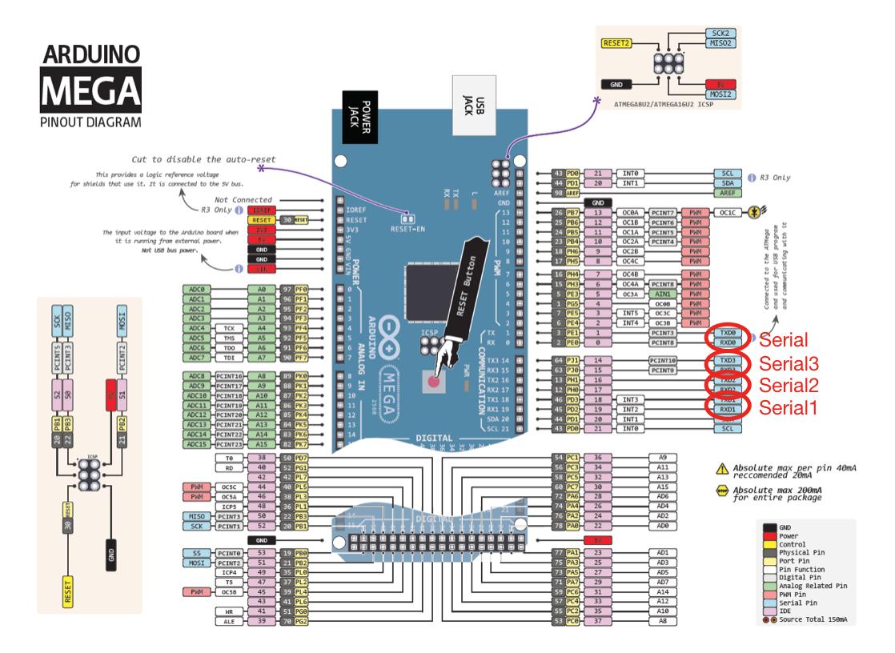

# ArduinoによるSerial通信 (送受信)

まず以下のシステムを考える



センサ値をArduinoAが読みとって、ArduinoBに有線で送って
無線送信してPCで受け取るシステム。

Arduino A から Arduino Bにデータを送信する方法について
軽く説明する。

実例1) 操舵基板→計測基板に舵角などを送信
実例2) WiFiモジュール↔操舵基板の通信(操舵設定用)

通信の方法はいろいろある。
以下ではセンサから読み取った値は int型(Arduinoでのint型はC言語の4byteと違って2byte) で変数名は ```sensorValueInt``` と、float型(Arduinoでは4byte)で変数名を ```sensorValueFloat``` の2つとする。

## ASCII通信
(俺が勝手ににこう呼んでるから一般的には通じないかも)

ASCII(American Standard Code for Information Interchange)通信は読み取った値をASCIIの文字列にしたまま送受信する方法である。
たとえば、`sensorValueInt = 334`, `sensorValueFloat = 1.14514`という値を送信するとする。


このASCII表を見ると 
“334” は

Hex(16進数)で `0x33 0x33 0x34`(16進数で数字を表す場合は先頭に `0x` をつけます )

Decimal(10進数)で `51 51 52`

Binary(2進数) で `00110011　00110011　00110100`

の3byte(24bit)で表現することができる。
  
実際にC言語で

```C
printf(“%c%c%c\n”, 51, 0x33, 52); // (%dではない)
printf(“%c%c%c\n”, ‘0’+3, ‘4’-1, 14 * 3 + 10);
```

とかやってみると “334” が出てくるだろう。

“1.14514” は

Hex(16進数) で `0x31 0x2E 0x31 0x34 0x35 0x31 0x34`

Decimal(10進数) で `49 46 49 52 53 49 52`

Binary(2進数) で `00110001　00101110　00110001　00110100　00110101　00110001　00110100`

の7byte(56bit)で表現することができる。

Arduinoで
```C++
Serial.print(sensorValueInt);
```
を実行すると、自動的に334(2進数で`0000000101001110`) が `001100110011001100110100`に変換され、以下のグラフように物理的にSerialピン経由で送信される。

パソコンに文字が表示されるのも実はこれのおかげ。

ちなみに送信されるとき、ArduinoのSerialのTX(Transmit)ピンの波形が以下のグラフのようになるが、0のときはGNDと短絡し、1のときは5Vと短絡(っぽいこと)するだけである。

(実際はこのまま送信される訳じゃないけど、今はまあこんな感じだと考えてOK。詳しくは[こちら](https://www.contec.com/jp/support/basic-knowledge/daq-control/serial-communicatin/)。)




また、`sensorValueFloat=1.14514`(2進数で`00111111100100101001001111110011`)
(詳しくはhttps://ja.wikipedia.org/wiki/IEEE_754) 
は
```C++
Serial.print(sensorValueFloat)
```
で`00110001　00101110　00110001　00110100　00110101　00110001　00110100`に変換されて先程と同様、



という波形がTXピンから出る。

ここでbaudrate (`Serial.begin(9600);`)で使ってる値 “9600” は1秒あたりのビット数を指すので
この波形の一つのパルス幅は (1.0x106 / 9600 = )104.166… マイクロ秒である。

***

### よく使うSerialクラスのメソッド

#### ASCIIの送信

```C++
Serial.print(sensorValueInt);
```
[詳細](https://goo.gl/YKNeL1)
```C++
Serial.println(sensorValueInt); // Serial.print() に改行文字 \n (0x0A)を最後につけるだけ
```
[詳細](https://goo.gl/GQHPHp) 

```C++
Serial.flush(); // 送信が完了するまで待つ
```
[詳細](https://goo.gl/g72PFL)

#### ASCIIの受信

```C++
int receiveInt = Serial.parseInt(); // long(整数値)型 受信されるまで待つ
```
[詳細](https://goo.gl/g553jD)
  
```C++
float receiveFloat = Serial.parseFloat(); // float型 受信されるまで待つ
```
[詳細](https://goo.gl/Jvx9f9) 

***

#### (補足) Arduino MEGAのSerialピン



Arduino MEGAにはハードウェアに付属されてるSerialピンが計4つある。

ちなみにArduino UNOには1つしかない。

ハードウェアの制約以上の数のSerialピンを使用したい場合は`SoftwareSerial`ライブラリを使うと良い。

***

### 使用例

2つのArduino MEGAでASCII通信してみよう。

ここでは Arduino A のSerial1 と Arduino BのSerial3を以下のようにつなげる。
- Arduino A TX1 18 ↔ Arduino B RX3 15
- Arduino B RX1 19 ↔ Arduino B TX3 14
- Arduino A GND ↔ Arduino B GND

通信はGNDからの相対的な電圧を測りながら行うので両者のGNDを一致させないといけない。

#### Arduino A (センサ値送信)
```C++
#define ANALOG_PIN A0

int sensorValueInt;

void setup () {
    pinMode(ANALOG_PIN, input);             // センサ入力の設定
    Serial1.begin(9600);                    // Serial1の有効化(Arduino Bとの通信用)
}

void loop () {
    sensorValueInt = analogRead(ANALOG_PIN);    // センサ値の読み取り
    Serial1.println(sensorValueInt);            // Serial1でセンサ値のASCII送信
    Serial1.flush();                            // 送信終了まで待つ(今回は必要ない)
    delay(1000);                                // ちょっと間隔をあける
}
```
#### Arduino B (センサ値受信)
```C++
int receiveInt;

void setup () {
    Serial.begin(9600);                 // Serialの有効化(PCとの通信用)
    Serial3.begin(9600);                // Serial3の有効化(Arduino Aとの通信用)
}

void loop () {
    receiveInt = Serial3.parseInt();    // Serial3から整数の読み取り
    Serial.println(receiveInt);         // Serialに読み取った整数を送信
}
```


