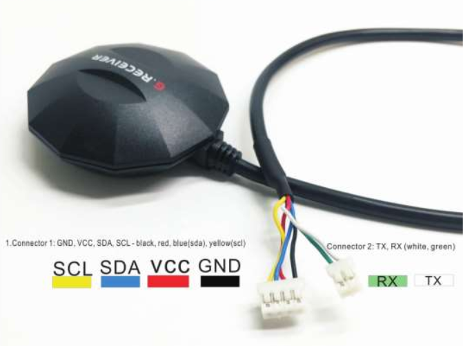

# GPS モジュール


[購入リンク](https://www.switch-science.com/catalog/3454/)

[データシート](https://cdn.sparkfun.com/assets/learn_tutorials/5/7/1/GPM-808G--UAV_GNSS_receiver_ublox8030_QMC5883.pdf)(ショボい!w)

### 仕様

- 重量
  - 40.9g
- 入力電圧
  - 3.3V 〜 5V
- 消費電力
  - だいたい 40mA
- チャンネル数
  - 72
- 通信プロトコル
  - I2C (マニュアルによると使えないっぽい)
  - RS232 シリアル
    - NMEA-0183
- 対応衛星
  - GPS
  - QZSS (ホンマか?って感じ)
  - GLONASS
- 感度
  - 捕捉
    - -148 dB
  - トラッキング
    - -167 dB
- 地磁気センサ (QMC-5883) 内蔵
  - 使い方知らん!w
- 外側の黒いカバーはノイズ防止の素材

### 接続例



|モジュール側|Arduino側|
|---|---|
|Vcc|5V|
|GND|GND|
|RX|TX|
|TX|RX|

耐久性の高い専用のコネクタをつくろう

### Arduinoで使用
[NMEAメッセージ](http://www.hiramine.com/physicalcomputing/general/gps_nmeaformat.html)をパースして取得可能な変数にするライブラリ
- [TinyGPS++](http://arduiniana.org/2013/09/tinygps-a-new-view-of-global-positioning/)
  - [GitHubレポジトリ](https://github.com/mikalhart/TinyGPSPlus)

#### u-center Windows

モジュール本体の設定は[u-center Windows](https://www.u-blox.com/en/product/u-center)アプリ で行える。(Mac非対応)

以下のようにArduino MEGA経由で通信すれば良い。

```C++
#include <SoftwareSerial.h>

#define GPS Serial1

void setup() {
  Serial.begin(115200);
  GPS.begin(115200);
}

void loop() {
  if(GPS.available() > 0) {
    Serial.write(GPS.read());
  }
  if (Serial.available() > 0) {
    GPS.write(Serial.read());
  }
}
```

#### 設定
2018年度WASAではGPSモジュールの設定
  - データ更新レート
    - 2Hz
  - Baudrate
    - 115200 bps
  - 受信衛星
    - GPS
    - SBAS
    - GLONASS
    - QZSS
    - Beidou
  - 受信NMEAセンテンス
    - GGA
      - UTC時間
      - 緯度経度
      - 使用衛星数
      - 水平精度低下率
    - GST
      - UTC時間
      - 水平誤差 σ=1　(緯度経度)
        - (TinyGPS++ライブラリでは手動で設定しないと取得できない)
    - RMC
      - UTC時間
      - 緯度経度
      - 対地速度(knots)
      - 進行方向
      - 日付

工場出荷状態でついているNMEAセンテンス

- GSV
- GLL

は必要ないので切っている。

特にGSVメッセージは非常に長いので切らないとArduinoの処理が間に合わないはず
