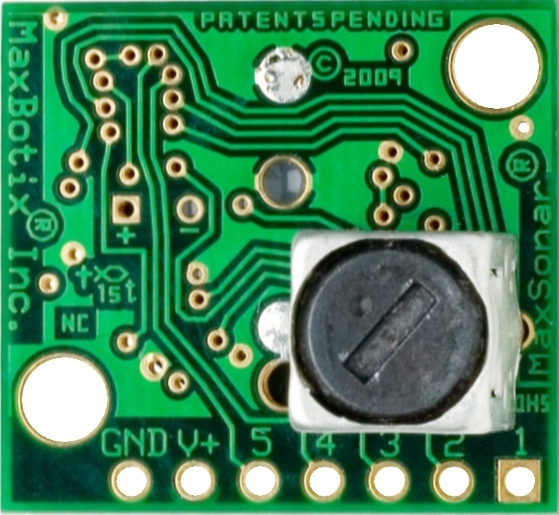

# 高度計

2018年度WASA鳥プロが使っている高度計は MaxSonar 社の ```MB1260``` です

マニュアル(英語)は[こちら](https://www.maxbotix.com/documents/XL-MaxSonar-EZ_Datasheet.pdf)


### 概要
- 機能
    - リアルタイム自動キャリブレーション
    - アナログ出力 (Vcc/1024) / 2
    - PWM出力
    - Serial出力
    - 10Hzでデータ取得可能
    - 3.3~5V電源　低消費電力
    - -40℃~65℃環境下で使用可
    - 10.68mまで計測可
- 利点
    - 複数のデータ出力
    - 低消費電力＝バッテリー駆動可能
    - 高サイクル
    - 取り付けが容易
- 注意
	- 25cm以下の計測では精度が落ちる

### ピンアウト情報


- Pin 1 - BW
	- Pin 5 でシリアル出力を行う場合は開放またはHighに短絡してください
	- Lowに短絡すると低ノイズチェニングモードになり、定期的にパルスを放ちます
		- 複数の超音波センサを使うときのみ有効です
- Pin 2 - PW
	- PWM出力ピン
	- 計測距離(cm)×58μsのパルスを定期的に放ちます (1.16ms ~ 62ms)
	- Arduinoでは `pulseIn(ALTI_PIN, HIGH, 124000) / 58.0; // cm単位`で取得可能
		- しかし、この方法ではデータ取得に最大124msの時間がかかってしまう(処理時間の無駄&)
		- 後で改善方法について説明する
	- 今年はこれを使っています
- Pin 3 - AN
	- アナログ出力ピン
	- 出力は計測距離1cmごとに(Vcc/1024)/2 V
	- Arduinoによる5V駆動では単純に ```analogRead(ALTI_PIN) * 2; // cm単位``` で取得可能
- Pin 4 - RX
	- 内部でプルアップされています。
	- 開放またはHighで距離を計測します。
	- Lowでは計測が停止します。
- Pin 5 - TX
	- Serial出力ピン0x52)に続いて、計測距離をASCII形式(3バイト分)、ASCII 0x0D文字を定期的に送信
		- 例 計測距離が134cmのとき、 `0x52 `
	- RS232規格, Baudrate-9600, 8bit, パリティなし, 1ストップbit
	- ノイズなどの外的要因に影響されないので本番にはできればこれを使うべき