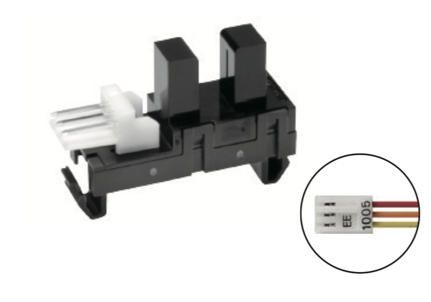
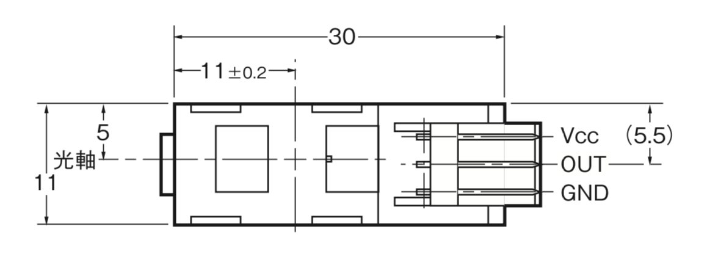
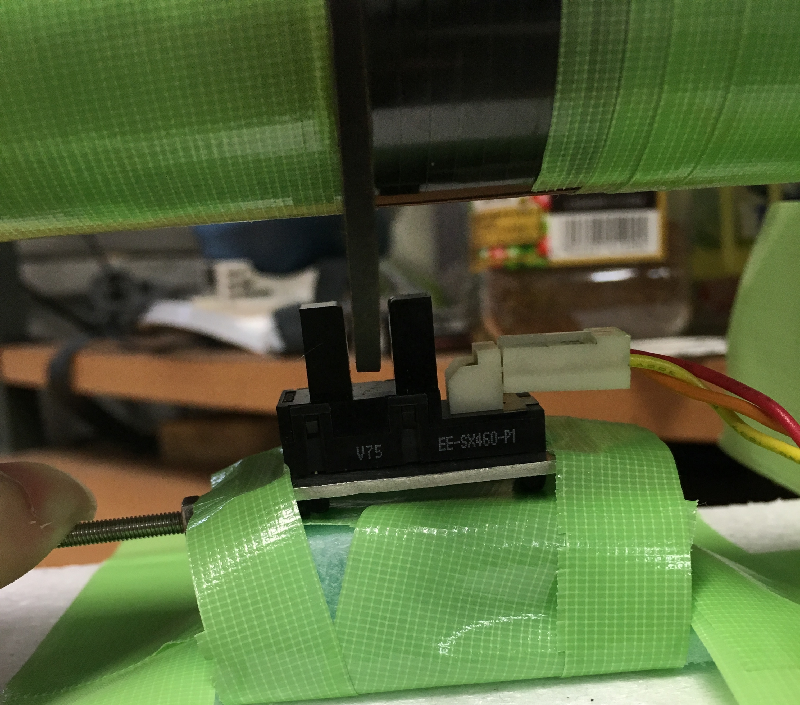
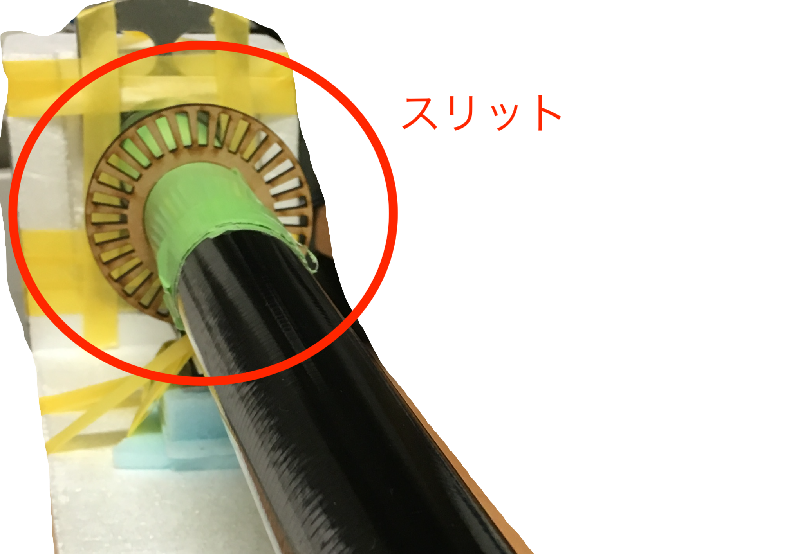
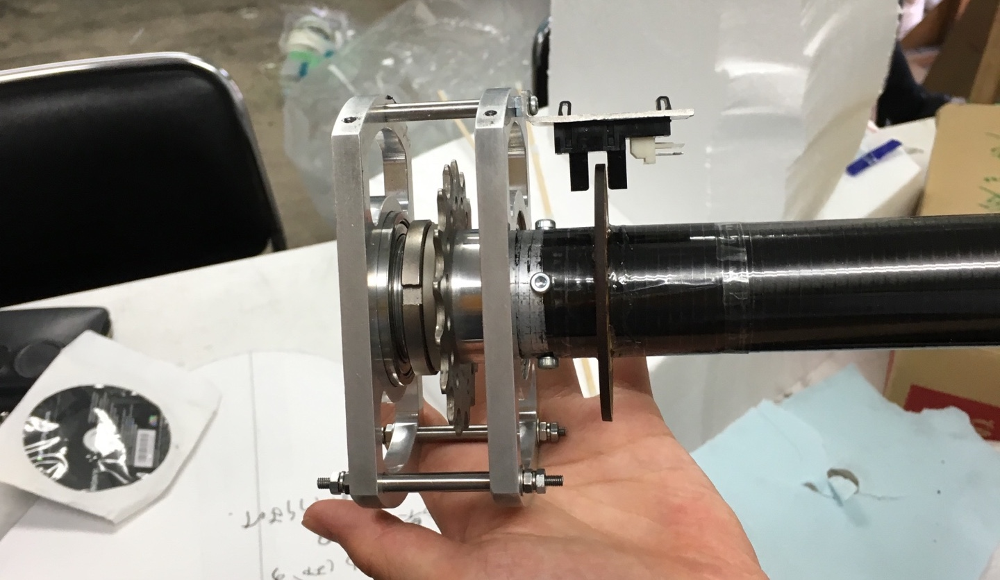

# 回転数計

フォトインタラプタ式を使っている


## フォト・マイクロセンサ

[データシート](http://omronfs.omron.com/ja_JP/ecb/products/pdf/ee_sx460_p1.pdf)



### 仕様

- T=25℃ Vcc=5V
    - 消費電力=30mA
    - LOW出力=0.3V
    - HIGH出力=4.5V

### 接続例



Vccに5V, GNDにGNDをつなげれば動作する。

- 光を遮っているとき
    - Vout=LOW
- 光を通しているとき
    - Vout=HIGH

接続のピンを間違えると内部回路が一瞬で焦げて壊れる。 (経験済み)



#### コネクタ規格

- ELシリーズコネクタ：[データシート](https://www.marutsu.co.jp/contents/shop/marutsu/datasheet/Pdf2664.pdf)
    - 普通の互換圧着工具で制作できる。
        - コネクタにかかる負荷を減らすために三つ編みにしたほうが良い。
    - マルツ(Online or アキバ2号店)で買える。 
        - ハウジング: [171822-3](https://www.marutsu.co.jp/pc/i/46498/)
        - コンタクト: [170262-1](https://www.marutsu.co.jp/pc/i/132592/)

### Arduinoでの使用

単位時間あたりのインタラプト回数を見れば回転数がわかる

インタラプトとは、各自で設定できる「割り込み処理」のことである。

```C++
#define PIN 2

attachInterrupt(digitalPinToInterrupt(PIN), ISR, CHANGE);
```

これを実行するとPINピンに状態変化(`CHANGE`)があった場合に`void ISR`関数が実行される。

#### 使用例

```C++

#define PROP_PIN 2          // プロペラ回転数計インタラプト専用ピン

volatile uint16_t prop_interrupts = 0; // 2byte以上の変数を割り込みと通常処理で使用する場合はvolitileをつける。(コンパイラ最適化の関係で)
uint32_t prop_rotation = 0;
uint32_t prop_curr_calc = 0;
uint32_t prop_last_calc = 0;
uint32_t prop_delta = 0;

void setup() {
  Serial.begin(9600);
  pinMode(PROP_PIN, INPUT_PULLUP);
  attachPropeller();
  interrupts();
  prop_last_calc = micros();
}

void loop() {
    readPropeller();
    Serial.println(prop_rotation * 0.0009375); 
    // r = 0.0009375 = 0.001 (i/ks -> i/s) * 60 (i/s -> i/m)/ 64(i/m -> r/m)
}

void attachPropeller() {
  attachInterrupt(digitalPinToInterrupt(PROP_PIN), prop_count_handle, CHANGE);
}

void detachPropeller() {
  detachInterrupt(digitalPinToInterrupt(PROP_PIN));
}

void prop_count_handle() {
  prop_interrupts++;
}

void readPropeller() {
  if ((uint32_t)(micros() - prop_last_calc) > min_prop_delta) {
    detachPropeller(); // 計算中に値が変わらないようにする
    prop_delta = (prop_curr_calc = micros()) - prop_last_calc;
    if (prop_interrupts > 5) {
      prop_rotation = (uint32_t)((double)1000000000.0 * ((double)prop_interrupts / prop_delta)); //[1000 interrupts per second]
    } else {
      prop_rotation = 0;
    }
    prop_interrupts = 0;
    prop_last_calc = micros();
    attachPropeller();
  }
}
```

スリット数32だとして、1秒で256回インタラプトが発生すれば回転数は(256÷(32×2)=)4 RPS

## スリット板

- MDFをレーザーカッターで加工
- 32スリット
- スリットが多いほうが精度はいい
    - 当然もろくなる



## 駆動部取付部

30代辺りの電装班がものづくり工房のおっちゃんと一緒に作ったのをずっと使いまわしている(らしい)。


