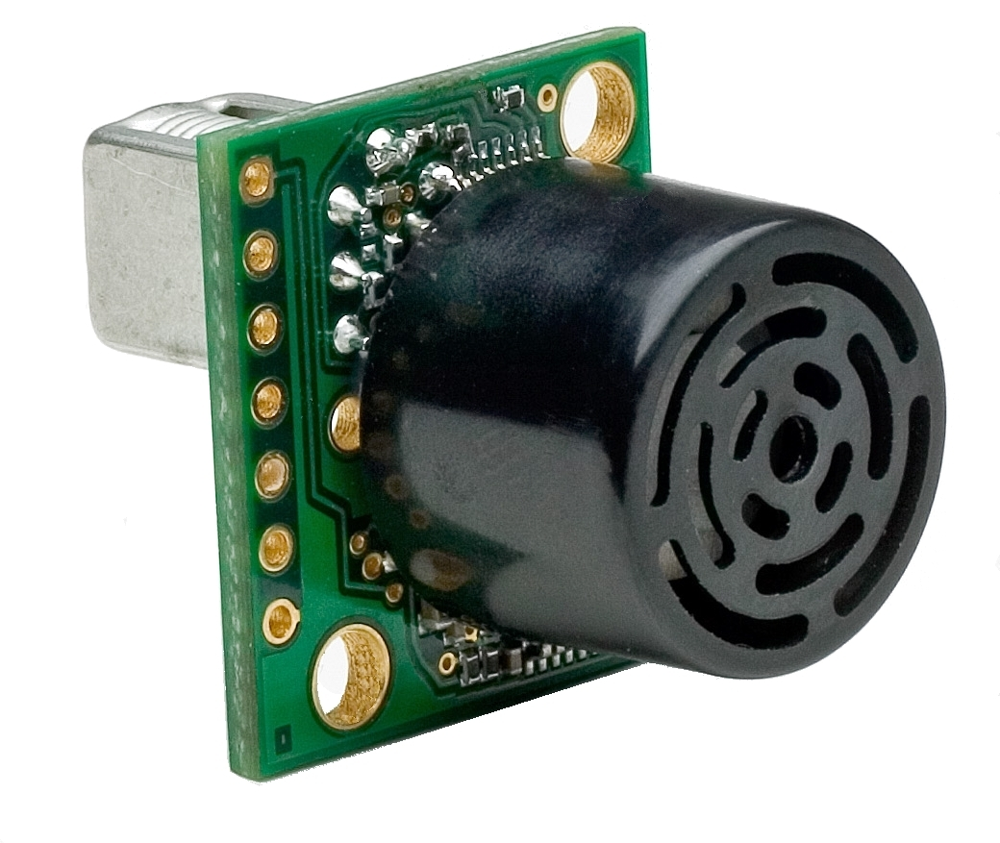
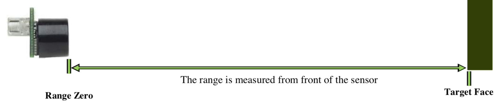
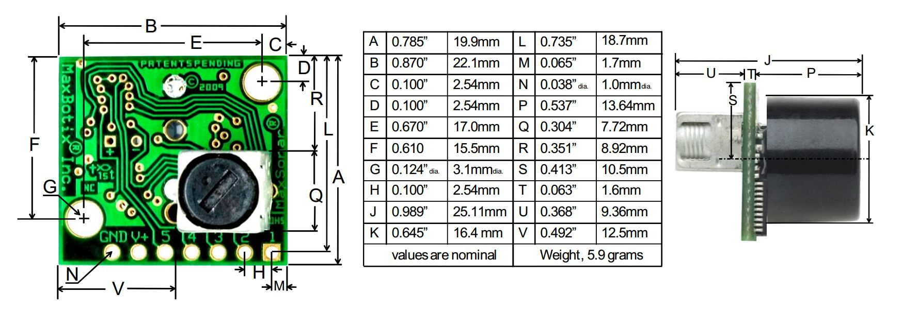
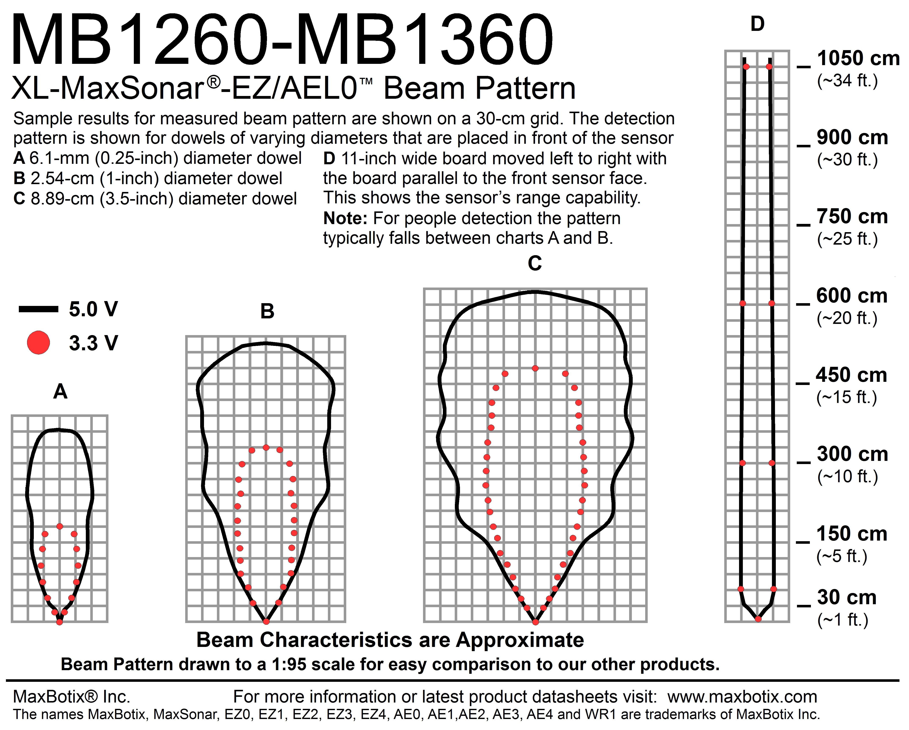
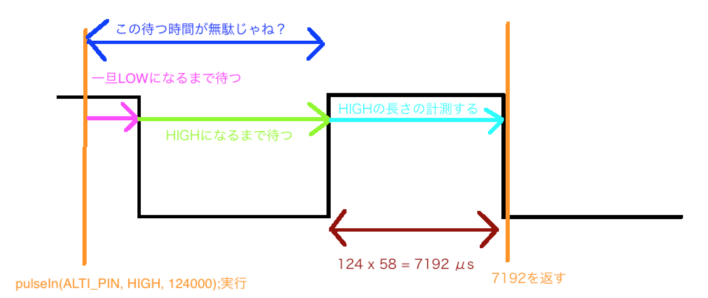

# 高度計

2018年度WASA鳥プロが使っている高度計は MaxSonar 社の [`MB1260`](https://www.maxbotix.com/Ultrasonic_Sensors/MB1260.htm) です

公式サイトで買うと死ぬほど送料が高い(1万とか)

在庫少なめだけど[**ここ**](https://www.tinyosshop.com/index.php?route=product/product&filter_name=MB1260&filter_description=true&filter_sub_category=true&product_id=805)で買うといいよ

マニュアル(英語)は[**こちら**](https://www.maxbotix.com/documents/XL-MaxSonar-EZ_Datasheet.pdf)


### 概要


- 機能
    - リアルタイム自動キャリブレーション
    - アナログ出力 (Vcc/1024) / 2
    - PWM出力
    - Serial出力
    - 10Hzでデータ取得可能
    - 3.3~5V電源　低消費電力
    - -40℃~65℃環境下で使用可
    - 10.68mまで計測可
- 利点
    - 複数のデータ出力
    - 低消費電力＝バッテリー駆動可能
    - 高サイクル
    - 取り付けが容易
- 注意
    - 25cm以下の計測では精度が落ちる

### ピンアウト情報


- Pin 1 - BW
    - Pin 5 でシリアル出力を行う場合は開放またはHighに短絡してください
    - Lowに短絡すると低ノイズチェニングモードになり、定期的にパルスを放ちます
        - 複数の超音波センサを使うときのみ有効です
- Pin 2 - PW
    - PWM出力ピン
    - 計測距離(cm)×58μsのパルスを定期的に放ちます (1.16ms ~ 62ms)
    - Arduinoでは `pulseIn(ALTI_PIN, HIGH, 124000) / 58.0; // cm単位`で取得可能
        - しかし、この方法ではデータ取得に最大124msの時間がかかってしまう(処理時間の無駄&)
        - 後で改善方法について説明する
    - 今年はこれを使っています
- Pin 3 - AN
    - アナログ出力ピン
    - 出力は計測距離1cmごとに(Vcc/1024)/2 V
    - Arduinoによる5V駆動では単純に `analogRead(ALTI_PIN) * 2; // cm単位` で取得可能
- Pin 4 - RX
    - 内部でプルアップされています。
    - 開放またはHighで距離を計測します。
    - Lowでは計測が停止します。
- Pin 5 - TX
    - Serial出力ピン0x52)に続いて、計測距離をASCII形式(3バイト分)、ASCII 0x0D文字を定期的に送信
        - 例 計測距離が134cmのとき、 `0x52 0x31 0x33 0x34 0x0D`が送られてくる(はず) (試してないからわからん)
    - RS232規格, Baudrate-9600, 8bit, パリティなし, 1ストップbit
    - ノイズなどの外的要因に影響されないので本番にはできればこれを使うべき
- Pin 6 - +5V
    - Vcc \(3.3V〜5V\)
    - 消費電流
        - 3.3V
            - 平均 2.1 mA
            - 最大 50 mA
        - 5V
            - 平均 3.4 mA
            - 最大 100 mA
    - 音波出力時に最大電流に達します。
- Pin 7 - GND
    - GNDと短絡。ノイズが少ないと良いよ。

### ゼロ点
Range Zeroって書いてあるとこ


### 図面


### 温度補正

音波は空気が1℃上がると0.6m/s速くなる

これはArduino側で補正できるらしいが、補正するための公式はMaxBotix社に問い合わせたら教えてくれる

現状、補正はしてない

### 音波形状


### PWMでのpulseIn()の使用
##### 問題点
Arduinoで`pulseIn(ALTI_PIN, HIGH, 124000);`を実行するとArduinoは`ALTI_PIN`ピンがHIGHである時間(μs)を計測してくれる

ALTI_PINが既にHIGHである状態でpulseIn()を実行すると以下のようになる

なお、計測距離を124cmのときを考える



理論上最大で120msぐらい待つことになっちゃうので、この時間に他の処理がしたい

特に9軸センサはupdateの頻度が大きければ大きいほど精度があがるし、
GPSからも頻繁にデータが投げられてくるのでいっぱい読み取ってみたいよね

##### 解決方法1
単純にPWMをやめてSerial入力にする

2018年度はもともとAnalog入力でやろうとして、精度が落ちやすいことが発覚してPWMに変えた

そこでさらに発覚した問題点なのでSerialに変えようとしたけど計測基板が既に完成していたのでPWMで頑張った

次年度以降はできればこれを実現してもらいたい

[このライブラリ](https://github.com/Diaoul/arduino-Maxbotix)使うと良いよ

[シリアルから取得できるようにいじったやつ](https://drive.google.com/drive/folders/0B0PAadAtzOAjbjdMYmZVNzVtQkk?usp=sharing)

##### 解決方法 2
Timerライブラリを使う

2018年度はこれで頑張った

###### 初期設定
```C++
#include <TimerOne.h> 
// 内部タイマー用ライブラリ/ライブラリマネージャから入手できます
// Timer1 はピン 11, 12を占有します。これらのピンではPWMによるanalogWriteができなくなります。
// Timer1 は当然だけそ1回しか使えない

#define ALTI_PIN A0         // 高度用アナログピン

uint8_t alti_curr_pulse = LOW;
uint8_t alti_last_time_pulse = LOW;

uint32_t alti_last_time = 0;
uint16_t alti_count = 0;
volatile uint16_t alti_tmp = 0;
// ISR関数とそれ以外の関数の両方で共有されている2byte以上の引数はvolatileが必要
// volatileがないと値が乱れる可能性があります (volatileでコンパイラによる最適化を回避する)
uint16_t alti = 0;          // 最終的な高度の値

void calcAltitude();        // ただのプロトタイプ宣言
void attachAltitude();      // ただのプロトタイプ宣言

void initAltitude() {       // setup()内に入れておく
    pinMode(ALTI_PIN, INPUT);
    Timer1.initialize(58);  // 58usごと
    attachAltitude();
}
```

###### インタラプトのオン/オフ用 関数
```C++
void attachAltitude() {
    Timer1.attachInterrupt(calcAltitude);
}

void detachAltitude() {
    Timer1.detachInterrupt();
}
```

###### インタラプトの割込みサービスルーチン(ISR)

この関数はTimerライブラリにより上で設定したように5強制的に8μsごとに実行される

58μsごとにHIGHである回数を`alti_count`に数えていって、LOWに変わったときそれを`alti_tmp`に代入
```C++
void calcAltitude() {
    alti_curr_pulse = digitalRead(ALTI_PIN);
    if (alti_curr_pulse == HIGH) { // HIGH
        alti_count++;
    } else if (alti_last_time_pulse == HIGH){ // HIGH -> LOW
        alti_tmp = alti_count;
        alti_count = 0;
    }
    alti_last_time_pulse = alti_curr_pulse;
}
```

###### 読み取りの関数 (loop()内に入れる)
```C++
void readAltitude() {
  if ((uint32_t)(millis() - alti_last_time) > 90) {
    detachAltitude();                               // インタラプトの停止 次の行で実行されるalti_tmpの読み取り中に値が変わってしまうことを防ぐ
    uint16_t diff = alti_tmp - alti;                // (オプション)高度の生の読み取り値はalti_tmpだけど、今回はsnap曲線で補正かける
    attachAltitude();                               // インタラプトの再開
    double snap = snapCurve(abs(diff) * 0.5);       // (オプション)SNAP MULTIPLIER 0.5 (計測間隔が90msと大きいので)
    alti += diff * snap;                            // (オプション) 補正後の高度の値
    alti_last_time = millis();
  }
}
```

###### スナップ曲線 (オプション)
高度から誤差を削除してうまく表示するための関数

スナップ曲線を用いる

詳細は[こちら](http://damienclarke.me/code/posts/writing-a-better-noise-reducing-analogread)(英語)

[良い使用例はこちら](https://codepen.io/dxinteractive/pen/zBEbpP#code-area)

```C++
double snapCurve(uint16_t x) {
  double y = 1 / ((double)x + 1);
  y = (1 - y) * 2;
  if (y > 1) {
    return 1.0;
  }
  return y;
}
```