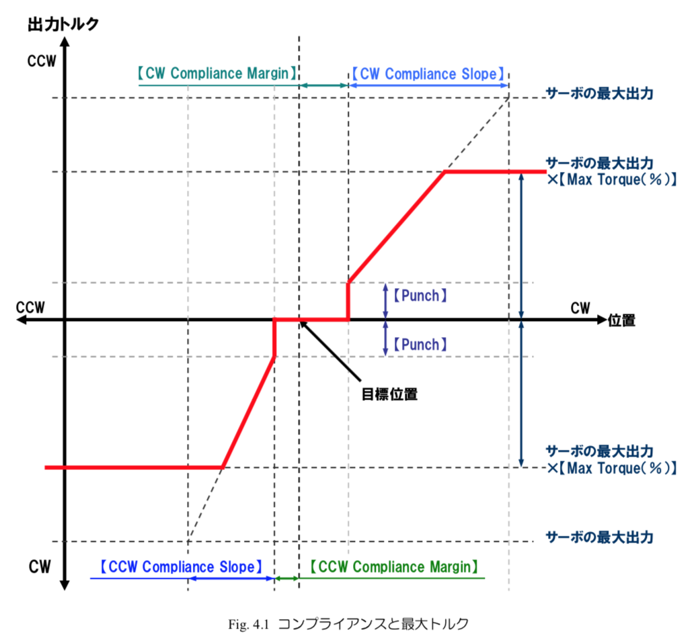

# RS405CB サーボモータ

(「サーボ」は略称なので設計資料などでは「サーボモータ」を使おう)

WASAでは結構前からFutaba製の**RS405CB**というハイトルク/ブラシレスモータのサーボを使用している

一般的に販売されている**PWM式サーボとは異なり**、**コマンド式サーボ**である

マニュアルは[こちら](http://www.futaba.co.jp/img/uploads/files/robot/command_type_servos/RS405CB_406CB_108.pdf)

## コマンド式を使う利点
- 角度をより精密に設定することができる
- サーボの状況がリアルタイムで把握できる
    - ギヤボックスの内部温度 (℃)
    - 実角度 (設定角とは別)
    - 入力電圧
    - 負荷 (電流 mA)
    - スピード (deg/sec)
- 詳細な設定が可能
    - トルクモード
        - OFF   = トルクオフ
        - ON    = トルクオン (最大トルク)
        - BREAK = ブレーキモード (手で動かせるぐらいのトルク)
    - コンプライアンスマージン
    - コンプライアンススロープ
    - パンチ
    - 最大トルク
    - ダンパー
    - 回転リミット角
    - サーボリバース
    - 通信速度 (baudrate)
    - などなど...

## 特徴
- RS485規格 非同期通信コマンド方式
- プラシレスモータ
- ソフトによるモータ制御
- 重量
    - 67 [g]
- 消費電流
    - 停止時
        - 30  [mA]  \(常温、無負荷、11.1V時\)
    - 動作時
        - 210 [mA]  \(常温、無負荷、11.1V時\)
- 出力トルク
    - 48.0 [kg･cm] \(11.1V\)
- 動作スピード
    - 0.21 [sec/60度] \(11.1V時\)
- 使用電圧範囲
    - 7.2 〜 12.0 [V]
- 使用温度範囲
    - 0 〜 40 [℃]
- 保存温度範囲
    - -20 〜 60 [℃]
- 通信速度
    - 最大460800bps (設定可能) (初期値115200bps)
- プロトコル
    - 8bit, 1 Stop bit, パリティなし, 非同期通信 (Serial)

## 通信
通信にはSerialを使う

### サーボID
> RS405CB は、個々に ID 番号を設定できます。

> サーボID は、コマンド方式での動作中にサーボの個体を識別するために付けられた固有の番号です。

> 初期値は1になっていますので、一つの通信系で複数のサーボを接続する場合は、IDが固有の値になるように各サーボに設定してください。

### メモリマップ

RS405CBサーボメータには3種類のメモリ領域が存在する

- 変更不可領域のメモリマップ
- ROM (Read-Only Memory) 領域のメモリマップ (電源を切っても残るデータ)
- RAM (Random-Access Memory) 領域のメモリマップ (いつでもアクセス可能・電源を切ると消える)

### パケット
RS405CBサーボモータとの通信はデータを「パケット」というデータの塊にいれて送り合うことでできる

マイコンとかからメモリマップに書き込む場合にはショートパケットまたはロングパケットをおくる

パケットには「ショートパケット」「ロングパケット」「リターンパケット」の3種類が存在する

- ショートパケット
    - 1つのサーボ(ID)に対して、データを送信するときに使用するパケット

- ロングパケット
    - 使ってないので省略
    - 通信の最適化がしたかったら使ったほうが良いかも

- リターンパケット
    - サーボにリターンパケットを要求したときに、サーボから送られてくるパケット
    - サーボの情報が入っている

#### ショートパケット
##### パケット構成
| Header | ID | Flags | Address | Length | Count | Data | Sum |
|---|---|---|---|---|---|---|---|

| Header |
|---|

パケットの先頭を表す (2byte)

ショートパケットでは `0xFA 0xAF` に設定する

| ID |
|---|

サーボID (1 byte)

`1〜127 (0x01〜0x7F)` まで設定可能

`255 (0xFF)` に設定すると全サーボへの共通司令となる

2018年度WASAではラダーのIDを1, エレベータのIDを2に設定している

| Flags |
|---|

パケットの詳細設定

使わないことが多いのでそういうときは `0x00` に設定

| Address |
|---|

メモリマップ上のアドレスを表す

このアドレス番号から「Length」に指定した長さ分のデータをメモリマップに書く込む

| Length |
|---|

データ1ブロックの長さを指定する

ショートパケットではDataのバイト数になる

| Count |
|---|

ショートパケットでメモリマップに書き込むときは `0x01` に設定する

| Data |
|---|

メモリマップに書き込むデータ

| Sum |
送信データの確認用チェックサム

パケットの [ID] から　[Data] の末尾までの1バイトずつを [XOR](https://ja.wikipedia.org/wiki/排他的論理和) した値を指定する

##### Flags について

| ビット | 機能 | 説明 |
|---|---|---|
| 7 | 未使用 | 常に0に設定すること |
| 6 | フラッシュROMへ書き込み | 電源を切っても現在の設定が復元されるようにする **フラッシュROM書き込み中は絶対に電源を切らないこと**|
| 5 | サーボの再起動 | 1に設定するとサーボが再起動する |
| 4 | メモリマップ(4~29)の値を初期値に戻す | 工場出荷時の状態に戻す |
| 3 | リターンパケットのアドレス指定 | 以下の説明を参照 |
| 2 | リターンパケットのアドレス指定 | |
| 1 | リターンパケットのアドレス指定 | |
| 0 | リターンパケットのアドレス指定 | |

- ビット 3〜0 : リターンパケットのアドレス指定

| ビット | 3 | 2 | 1 | 0 | 機能 |
|-------|---|---|---|---|-----|
|       | 0 | 0 | 0 | 0 | リターンパケットなし |
|       | 0 | 0 | 0 | 1 | ACK/NACKパケットの返信要求 |
|       | 0 | 0 | 1 | 1 | メモリマップ 0〜29の返信要求 |
|       | 0 | 1 | 0 | 1 | メモリマップ 30〜59の返信要求 |
|       | 0 | 1 | 1 | 1 | メモリマップ 20〜29の返信要求 |
|       | 1 | 0 | 0 | 1 | メモリマップ 42〜59の返信要求 |
|       | 1 | 0 | 1 | 1 | メモリマップ 30〜41の返信要求 |
|       | 1 | 1 | 0 | 1 | メモリマップ 60〜127の返信要求 |
|       | 1 | 1 | 1 | 1 | 指定アドレスから指定バイト数の返信要求 |

