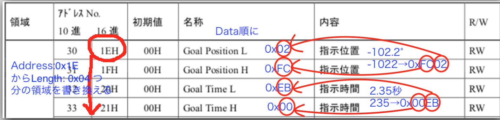

# RS405CB サーボモータ

(「サーボ」は略称なので設計資料などでは「サーボモータ」を使おう)

WASAでは結構前からFutaba製の**RS405CB**というハイトルク/ブラシレスモータのサーボを使用している

一般的に販売されている**PWM式サーボとは異なり**、**コマンド式サーボ**である

マニュアルは[こちら](http://www.futaba.co.jp/img/uploads/files/robot/command_type_servos/RS405CB_406CB_108.pdf)

このページにはマニュアルに書いてあることしか書かないので、しっかり知りたいなら代わりにそっちを読むべきです。

## コマンド式を使う利点
- 角度をより精密に設定することができる
- サーボの状況がリアルタイムで把握できる
    - ギヤボックスの内部温度 (℃)
    - 実角度 (設定角とは別)
    - 入力電圧
    - 負荷 (電流 mA)
    - スピード (deg/sec)
- 詳細な設定が可能
    - トルクモード
        - OFF   = トルクオフ
        - ON    = トルクオン (最大トルク)
        - BREAK = ブレーキモード (手で動かせるぐらいのトルク)
    - コンプライアンスマージン
    - コンプライアンススロープ
    - パンチ
    - 最大トルク \(0〜100%\)
    - ダンパー
    - 回転リミット角
    - サーボリバース
    - 通信速度 (baudrate)
    - などなど...


## 特徴
- RS485規格 非同期通信コマンド方式
- プラシレスモータ
- ソフトによるモータ制御
- 重量
    - 67 [g]
- 消費電流
    - 停止時
        - 30  [mA]  \(常温、無負荷、11.1V時\)
    - 動作時
        - 210 [mA]  \(常温、無負荷、11.1V時\)
- 出力トルク
    - 48.0 [kg･cm] \(11.1V\)
- 動作スピード
    - 0.21 [sec/60度] \(11.1V時\)
- 使用電圧範囲
    - 7.2 〜 12.0 [V]
    	- 3Sのリポは最大電圧が12.6Vに達するので気をつけて
- 使用温度範囲
    - 0 〜 40 [℃]
    	- 夏は暑い
    	- 2016年度WASAでは鳥コンのフライト直前にサーボの熱暴走が発生している
    		- 高負荷を長時間かけないようにすること
    		- 充分に冷却できる体制を取ること
    		- トルクをフライト直前に入れられるようにすること
- 保存温度範囲
    - -20 〜 60 [℃]
- 通信速度
    - 最大460800bps (設定可能) (初期値115200bps)
- プロトコル
    - 8bit, 1 Stop bit, パリティなし, 非同期通信 (Serial)

## 通信
通信にはSerial(RS485)を使う

### サーボID
> RS405CB は、個々に ID 番号を設定できます。

> サーボID は、コマンド方式での動作中にサーボの個体を識別するために付けられた固有の番号です。

> 初期値は1になっていますので、一つの通信系で複数のサーボを接続する場合は、IDが固有の値になるように各サーボに設定してください。

### メモリマップ

RS405CBサーボメータには3種類のメモリ領域が存在する

- 変更不可領域のメモリマップ
	- 変更できない定数
    - [マニュアル P.25](http://www.futaba.co.jp/img/uploads/files/robot/command_type_servos/RS405CB_406CB_108.pdf#page=25)
- ROM (Read-Only Memory) 領域のメモリマップ 
	- 電源を切っても残るデータ
	- フラッシュROMへの書き込みを行わないと電源を切った後にもとに戻っちゃう
    - [マニュアル P.26](http://www.futaba.co.jp/img/uploads/files/robot/command_type_servos/RS405CB_406CB_108.pdf#page=26)
- RAM (Random-Access Memory) 領域のメモリマップ
	- いつでもアクセス可能・電源を切ると消える
    - [マニュアル P.33](http://www.futaba.co.jp/img/uploads/files/robot/command_type_servos/RS405CB_406CB_108.pdf#page=33)

### パケット
RS405CBサーボモータとの通信はデータを「パケット」というデータの塊にいれて送り合うことでできる

マイコンなどからメモリマップに書き込む場合にはパケットをおくる

パケットには「ショートパケット」「ロングパケット」「リターンパケット」の3種類が存在する

- ショートパケット
    - 1つのサーボIDに対して、データを送信するときに使用するパケット

- ロングパケット
	- 複数のサーボIDに対して、同時にデータを送信するときにしようするパケット
    - 使ってないので具体的な説明は省略
    - 通信の最適化がしたかったら使ったほうが良いかも

- リターンパケット
    - サーボにリターンパケットを要求したときに、サーボから送られてくるパケット
    - サーボの情報が入っている

#### ショートパケット
##### パケット構成
| Header | ID | Flags | Address | Length | Count | Data | Sum |
|---|---|---|---|---|---|---|---|

| Header |
|---|

パケットの先頭を表す (2byte)

ショートパケットでは `0xFA 0xAF` に設定する

| ID |
|---|

サーボID (1 byte)

`1〜127 (0x01〜0x7F)` まで設定可能

`255 (0xFF)` に設定すると全サーボへの共通司令となる

2018年度WASAではラダーのIDを1, エレベータのIDを2に設定している

| Flags |
|---|

パケットの詳細設定

使わないことが多いのでそういうときは `0x00` に設定

| Address |
|---|

メモリマップ上のアドレスを表す

このアドレス番号から「Length」に指定した長さ分のデータをメモリマップに書く込む

| Length |
|---|

データ1ブロックの長さを指定する

ショートパケットではDataのバイト数になる

| Count |
|---|

ショートパケットでメモリマップに書き込むときは常に `0x01` に設定する

| Data |
|---|

メモリマップに書き込むデータ

| Sum |
|---|

送信データの確認用チェックサム

送信中にパケットがノイズで変わってしまってもこれのおかげで引っかかって無効になる。
サーボの角度を 90.0° (900 -> 0x0384 -> 0000001110000100 )に変えようとしたときにノイズで `0000001110000100` が `00000"1"1110000100`
に変わってしまったら　192.4° (0000011110000100 -> 0x0784 -> 1924) に動こうとしてしまう。
しかし、送信したチェックサムは不変なのでサーボ側でチェックサムを再計算したときに不一致となり、パケットは却下される。

パケットの [ID] から　[Data] の末尾までの1バイトずつを [XOR](https://ja.wikipedia.org/wiki/排他的論理和) した値を指定する

##### Flags について

| ビット | 機能 | 説明 |
|---|---|---|
| 7 | 未使用 | 常に0に設定すること |
| 6 | フラッシュROMへ書き込み | 電源を切っても現在の設定が復元されるようにする **フラッシュROM書き込み中は絶対に電源を切らないこと**|
| 5 | サーボの再起動 | 1に設定するとサーボが再起動する |
| 4 | メモリマップ(4~29)の値を初期値に戻す | 1に設定すると工場出荷時の状態に戻る |
| 3 | リターンパケットのアドレス指定 | 以下の説明を参照 |
| 2 | リターンパケットのアドレス指定 | |
| 1 | リターンパケットのアドレス指定 | |
| 0 | リターンパケットのアドレス指定 | |

- ビット 3〜0 : リターンパケットのアドレス指定

| ビット | 3 | 2 | 1 | 0 | 機能 |
|-------|---|---|---|---|-----|
|       | 0 | 0 | 0 | 0 | リターンパケットなし |
|       | 0 | 0 | 0 | 1 | ACK/NACKパケットの返信要求 |
|       | 0 | 0 | 1 | 1 | メモリマップ 0〜29の返信要求 |
|       | 0 | 1 | 0 | 1 | メモリマップ 30〜59の返信要求 |
|       | 0 | 1 | 1 | 1 | メモリマップ 20〜29の返信要求 |
|       | 1 | 0 | 0 | 1 | メモリマップ 42〜59の返信要求 |
|       | 1 | 0 | 1 | 1 | メモリマップ 30〜41の返信要求 |
|       | 1 | 1 | 0 | 1 | メモリマップ 60〜127の返信要求 |
|       | 1 | 1 | 1 | 1 | 指定アドレスから指定バイト数の返信要求 |

##### ショートパケットの構成例

###### 例1) ID=2のサーボを 92.1° ( 921 -> 0x0399 ) の位置に動かす。

指示位置のアドレスは下位アドレスが0x1E, 上位アドレスが0x1F。
[マニュアル P.33](http://www.futaba.co.jp/img/uploads/files/robot/command_type_servos/RS405CB_406CB_108.pdf#page=33)。


| Header | ---  | ID   | Flag | Address | Length | Count | Data | ---  | Sum  |
| ------ | ---- | ---- | ---- | ------- | ------ | ----- | ---- | ---- | ---- |
| 0xFA   | 0xAF | 0x02 | 0x00 | 0x1E    | 0x02   | 0x01  | 0x99 | 0x03 | 0x85 |

チェックサム (Sum) の計算

ID から Data の最後のバイトまで1ビットずつXORする。

| 項目 | 内容 (hex) | 内容 (bin) |
| --- | ---- | --------- |
| ID  | 0x02 | 0000 0010 |
| Flg | 0x00 | 0000 0000 |
| Adr | 0x1E | 0001 1110 |
| Len | 0x02 | 0000 0010 |
| Cnt | 0x01 | 0000 0001 |
| Dat | 0x99 | 1001 1001 |
| --- | 0x03 | 0000 0011 |
| --- | ---- | --------- |
| Sum | 0x85 | 1000 0101 |

XOR 解釈1: Sumは縦の列で1が奇数個なら1, 偶数個なら0になる。

XOR 解釈2: キャリーが発生しない足し算

###### 例2) ID=1のサーボを-90.0° (-900 -> 0xFC7C ) (負の数は[2の補数](https://ja.wikipedia.org/wiki/2の補数)表現) の位置に動かす。

| Header | ---  | ID   | Flag | Address | Length | Count | Data | ---  | Sum  |
| ------ | ---- | ---- | ---- | ------- | ------ | ----- | ---- | ---- | ---- |
| 0xFA   | 0xAF | 0x01 | 0x00 | 0x1E    | 0x02   | 0x01  | 0x7C | 0xFC | 0x9C |


###### 例3) ID=2のサーボを 2.35秒 (235 -> 0x00EB)かけて-102.2° (-1022 -> 0xFC02)の位置に動かす。

| Header | ---  | ID   | Flag | Address | Length | Count | Data | ---  | ---  | ---  | Sum  |
| ------ | ---- | ---- | ---- | ------- | ------ | ----- | ---- | ---- | ---- | ---- | ---- |
| 0xFA   | 0xAF | 0x02 | 0x00 | 0x1E    | 0x04   | 0x01  | 0x02 | 0xFC | 0xEB | 0x00 | 0x0C |



###### 例4) ID=1 のサーボのトルクをONにする。
| Header | ---  | ID   | Flag | Address | Length | Count | Data | Sum  |
| ------ | ---- | ---- | ---- | ------- | ------ | ----- | ---- | ---- |
| 0xFA   | 0xAF | 0x01 | 0x00 | 0x24    | 0x01   | 0x01  | 0x01 | 0x24 |

###### 例5) ID=1 のサーボのトルクをOFFにする。
| Header | ---  | ID   | Flag | Address | Length | Count | Data | Sum  |
| ------ | ---- | ---- | ---- | ------- | ------ | ----- | ---- | ---- |
| 0xFA   | 0xAF | 0x01 | 0x00 | 0x24    | 0x01   | 0x01  | 0x00 | 0x25 |

###### 例6) ID=1 のサーボのトルクをBREAK MODEにする。
| Header | ---  | ID   | Flag | Address | Length | Count | Data | Sum  |
| ------ | ---- | ---- | ---- | ------- | ------ | ----- | ---- | ---- |
| 0xFA   | 0xAF | 0x01 | 0x00 | 0x24    | 0x01   | 0x01  | 0x02 | 0x27 |

###### 例7) ID=2 のサーボの最大トルクを75% (75 -> 0x4B)に設定する。(まあ使わないっしょ)
| Header | ---  | ID   | Flag | Address | Length | Count | Data | Sum  |
| ------ | ---- | ---- | ---- | ------- | ------ | ----- | ---- | ---- |
| 0xFA   | 0xAF | 0x02 | 0x00 | 0x23    | 0x01   | 0x01  | 0x4B | 0x6A |

###### 例8) サーボIDをID=1からID=2に書き換え (工場出荷値ID=1)
| Header | ---  | ID   | Flag | Address | Length | Count | Data | Sum  |
| ------ | ---- | ---- | ---- | ------- | ------ | ----- | ---- | ---- |
| 0xFA   | 0xAF | 0x01 | 0x00 | 0x04    | 0x01   | 0x01  | 0x02 | 0x07 |

###### 例9) ID=02のサーボの通信速度を9600bpsに変える
| Header | ---  | ID   | Flag | Address | Length | Count | Data | Sum  |
| ------ | ---- | ---- | ---- | ------- | ------ | ----- | ---- | ---- |
| 0xFA   | 0xAF | 0x01 | 0x00 | 0x06    | 0x01   | 0x01  | 0x00 | 0x07 |

| 設定値 | 速度 (bps)|
| ---- | -------- |
| 0x00 | 9,600    |
| 0x01 | 14,400   |
| 0x02 | 19,200   |
| 0x03 | 28,800   |
| 0x04 | 38,400   |
| 0x05 | 57,600   |
| 0x06 | 76,800   |
| 0x07 | 115,200  |
| 0x08 | 153,600  |
| 0x09 | 230,400  |
| 0x0A | 460,800  |

通信速度遅い方がノイズ耐性が高くなり、通信は安定する。速度と安定性はトレードオフの関係にある。

また、有線での高速通信は長距離に向いてないので速度と通信距離もトレードオフの関係にある。

サーボIDや通信速度はROM領域に入っているので、電源を切っても値を保持してもらいたい場合はフラッシュROMへの書き込みが必要となる。

###### 例10) ID=1のサーボのフラッシュROMへの書き込み
| Header | ---  | ID   | Flag | Address | Length | Count | Sum  |
| ------ | ---- | ---- | ---- | ------- | ------ | ----- | ---- |
| 0xFA   | 0xAF | 0x01 | 0x40 | 0xFF    | 0x00   | 0x00  | 0xBE |

###### 例11) ID=1のサーボを再起動
| Header | ---  | ID   | Flag | Address | Length | Count | Sum  |
| ------ | ---- | ---- | ---- | ------- | ------ | ----- | ---- |
| 0xFA   | 0xAF | 0x01 | 0x20 | 0xFF    | 0x00   | 0x00  | 0xDE |

> 通信速度や ID の変更と ROM への書き込みおよびサーボの再起動は、同時に行うことができません。
> 必すデータ書込み後に ROM 書き込みとサーボの再起動を別途実行してください。

###### 例12) リターンパケットの要求
ID=1のサーボのアドレス0x23からの18(0x12)バイト分の値を取得する
| Header | ---  | ID   | Flag | Address | Length | Count | Sum  |
| ------ | ---- | ---- | ---- | ------- | ------ | ----- | ---- |
| 0xFA   | 0xAF | 0x01 | 0x0F | 0x23    | 0x12   | 0x00  | 0x3F |

#### リターンパケット
##### パケット構成
| Header | ID | Flags | Address | Length | Count | Data | Sum |
|---|---|---|---|---|---|---|---|

| Header |
|---|

先頭 2 byte を示す

必ず`0xFD 0xDF` であることを確認する

| ID |
|---|

サーボID (1 byte)

リターンパケットを送ってくれたサーボID

2018年度WASAではラダーのIDを1, エレベータのIDを2に設定している

| Flags |
|---|

サーボの状態を示す

| ビット | 値 | 機能 |
|---|---|---|
| 7 | 0:正常 1:異常 | 温度リミット(60℃)に達しているかどうか(トルクはOFFになる) |
| 6 | 0 | 未使用 |
| 5 | 0:正常 1:異常 | 温度リミットアラーム(40℃)に達しているかどうか |
| 4 | 0 | 未使用 |
| 3 | 0:正常 1:異常 | フラッシュROM書き込みエラー |
| 2 | 0 | 未使用 |
| 1 | 0:正常 1:異常 | 受信パケット処理不可能エラー|
| 0 | 0 | 未使用 |

| Address |
|---|

メモリマップ上のアドレスを表す

| Length |
|---|

リターンデータのバイト数

| Count |
|---|

リターンパケットでは常に1に設定される

| Data |
|---|

リターンデータ

| Sum |
|---|

受信データの確認用チェックサム

必ず受信側で一致しているか確認すること

##### リターンパケットの構成例
上の例12から得られるパケット例

|項目|内容|
|---|---|
|最大トルク| 100%|
|トルクモード| ON|
|現在位置| -90.0°|
|現在時間| 0|
|スピード| 0|
|現在負荷| 50mA|
|現在温度| 36℃|
|現在電圧| 11.1V|

|パケット項目|内容|アドレス| 詳細 |
|---|---|---|---|
|Hdr| 0xFD | | |
|---| 0xFD | | |
|ID | 0x01 | | |
|Flg| 0x00 | | |
|Adr| 0x23 | | |
|Len| 0x12 | | |
|Cnt| 0x01 | | |
|Dat| 0x64 | 0x23 | 最大トルク |
|---| 0x01 | 0x24 | トルクON |
|---| 0x00 | 0x25 | 予備 |
|---| 0x00 | 0x26 | 予備 |
|---| 0x00 | 0x27 | 予備 |
|---| 0x00 | 0x28 | 予備 |
|---| 0x00 | 0x29 | 予備 |
|---| 0x7C | 0x2A | 現在位置 L |
|---| 0xFC | 0x2B | 現在位置 H |
|---| 0x00 | 0x2C | 現在時間 L |
|---| 0x00 | 0x2D | 現在時間 H |
|---| 0x00 | 0x2E | 現在スピード L |
|---| 0x00 | 0x2F | 現在スピード H |
|---| 0x32 | 0x30 | 現在負荷 L |
|---| 0x00 | 0x31 | 現在負荷 H |
|---| 0x24 | 0x32 | 現在温度 L |
|---| 0x00 | 0x33 | 現在温度 H |
|---| 0x56 | 0x34 | 現在電圧 L |
|---| 0x04 | 0x35 | 現在電圧 H |
|Sum| 0x90 | | |

### Arduinoにおけるパケット送受信
#### 送信例
```C++

#define TAIL_COMM_ENABLE_PIN 8
#define SERVO_SERIAL Serial2

uint8_t servo_tx_packet[256];

void setup() {
	SERVO_SERIAL.begin(9600);
	pinMode(TAIL_COMM_ENABLE_PIN, OUTPUT);
	servo_reboot(1); // 起動する
	servo_torque_value(1, 1); // トルクモードをONにする
}

void loop() {
	servo_move(1, -1500, 200);
	delay(2000);
	servo_move(1, 1500, 200);
	delay(2000);
}

void servo_reboot(uint8_t id) {
  servo_tx_packet[0] = 0xFA;                                     //Header
  servo_tx_packet[1] = 0xAF;                                     //Header
  servo_tx_packet[2] = id;                                       //ID
  servo_tx_packet[3] = 0x20;                                     //Flags
  servo_tx_packet[4] = 0xFF;                                     //Address
  servo_tx_packet[5] = 0x00;                                     //Length
  servo_tx_packet[6] = 0x00;                                     //Count
  servo_tx_packet[7] = checksum(servo_tx_packet, 7);             //sum

  transmit_packet(8);
  delay(30);
}

void servo_set_torque_mode(uint8_t id, uint8_t state) {
  servo_tx_packet[0] = 0xFA;                                     //Header
  servo_tx_packet[1] = 0xAF;                                     //Header
  servo_tx_packet[2] = id;                                       //ID
  servo_tx_packet[3] = 0x00;                                     //Flags
  servo_tx_packet[4] = 0x24;                                     //Address
  servo_tx_packet[5] = 0x01;                                     //Length
  servo_tx_packet[6] = 0x01;                                     //Count
  servo_tx_packet[7] = (uint8_t) state & 0x00FF;                    //ON/OFF
  servo_tx_packet[8] = checksum(servo_tx_packet, 8);               //sum

  if (!(state == 0 || state == 1 || state == 2)) return;
  transmit_packet(9);
}

void servo_move(uint8_t id, uint16_t o_angle, uint16_t o_time) {
  servo_tx_packet[0] = 0xFA;                            //Header
  servo_tx_packet[1] = 0xAF;                            //Header
  servo_tx_packet[2] = id;                              //ID
  servo_tx_packet[3] = 0x00;                            //Flags
  servo_tx_packet[4] = 0x1E;                            //Address
  servo_tx_packet[5] = 0x04;                            //Length
  servo_tx_packet[6] = 0x01;                            //Count
  servo_tx_packet[7] = lowByte(o_angle);                //目標位置データ(下位バイト)
  servo_tx_packet[8] = highByte(o_angle);               //目標位置データ(上位バイト)
  servo_tx_packet[9] = lowByte(o_time);                 //目標時間データ(下位バイト)
  servo_tx_packet[10] = highByte(o_time);               //目標時間データ(上位バイト)
  servo_tx_packet[11] = checksum(servo_tx_packet, 11);    //Checksum

  transmit_packet(12);
}

void transmit_packet(uint8_t len) {
  digitalWrite(TAIL_COMM_ENABLE_PIN, HIGH);       //送信許可
  SERVO_SERIAL.write(servo_tx_packet, len);       //サーボに送信
  SERVO_SERIAL.flush();                           //リードバッファを初期化(送信データがすべて送信されるまで待つ)
  digitalWrite(TAIL_COMM_ENABLE_PIN, LOW);        //送信禁止
}

uint8_t checksum(uint8_t * data, uint8_t len) {
  uint8_t sum = 0;
  for (uint8_t i = 2; i < len; i++) sum ^= data[i];
  return sum;
}
```

受信については操舵系統の [レポジトリ](https://github.com/MojamojaK/WASA-Control/blob/master/futaba_servo.h) \(268〜353行目\)でみてね。

安全性を保ちながらまあ効率的に受信していると思う。