# XBeeの設定

> 以下の説明はXBee S2B(一個前のバージョン)についてとなる

> 2018年9月現在はS2Cモジュールが出ており、いろいろと変わっているので内容は必ずしも正しいとはいえない

> 個人的に無線モジュールの素晴らしさは XBee S2B < TWE-Lite < XBee S2C って感じ

XBee本体の設定は[XCTU](https://www.digi.com/products/xbee-rf-solutions/xctu-software/xctu)というアプリケーションで行える

定期的にソフトウェアの更新が行われているので常に最新のバージョンを使うようにすること

#### XBeeとは
- 無線通信を行うモジュール
- [S2B ドキュメンテーション](https://www.digi.com/resources/documentation/digidocs/PDFs/90000976.pdf)
- 2018年度WASAは2.4GHzモデルを使った
    - 秋月で買った
- 2つの通信モード
    - ネットワーク全体で同じ通信モードである必要がある
    - XBee AT モード
        - 2017年度まではこっちを使ってた
        - 何も設定せずにSerial通信(UART)が行えるモード
        - [使用例](https://www.storange.jp/2017/05/arduinoxbee.html)
    - XBee API モード
        - 2018年度WASAではこっちを使っている
        - パケットとしてデータを送受信したい際に使うモード
        - ネットに落ちてる使い方説明は少ない
        - ATモードより高速に通信できる
        - Arduino用APIモード[ライブラリ](https://github.com/andrewrapp/xbee-arduino)
- 3つの役割
    - Coordinator
        - ネットワークの中心
            - 女王蜂みたいな感じ
            - これがネットワークに1つないと全体が機能しない
            - 2つ以上あるとネットワークは壊れる
                - !!!絶対に同じアドレスのCoordinatorの電源を同時に入れてはいけない!!!
        - ネットワークの中心であること以外はRouterと同じ
    - Router
        - データの受信や自分からの発信ができる
        - 他のXBeeから受信して、次のXBeeに受け渡せる
            - ネットワークの仲介人
            - 常に監視しているので消費電力は比較的大きい
                - 人力飛行機では正直気にしなくて良いレベル
        - 何個あっても大丈夫
    - End-Device
        - データの受信や自分からの発信はできる
        - 仲介はできない
        - 低消費電力
            - 定期的にスリープに入る
        - 何個あっても大丈夫
- 2つのアドレス指定方法
    - Broadcast
        - ネットワーク上の全てのデバイスにデータを送信する
        - ペイロードは92Byteまで
        - XBeeの通信アルゴリズム的に3回の送受信を繰り返すのでできる間隔は長くなってしまう
            - 要は送信してから受信するまでがめっちゃ遅い
            - S2Cモジュールではこれが改善されて使いものになるかも？？
    - Unicast
        - 2018年度WASAでは基本的にこっちを使った
        - 指定したアドレスの1つのXBeeにペイロードを送信
        - ペイロードは84Byteまで

#### ネットワーク例
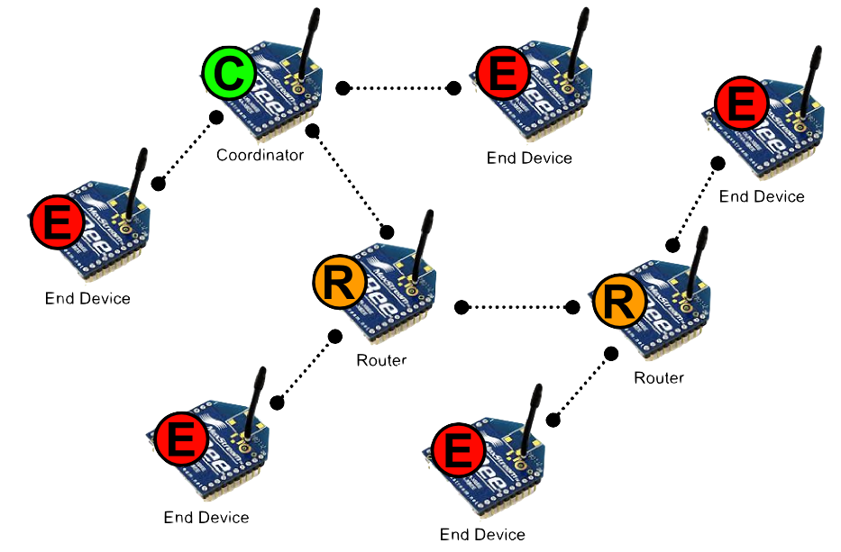

###### 2018年度WASAのネットワーク例
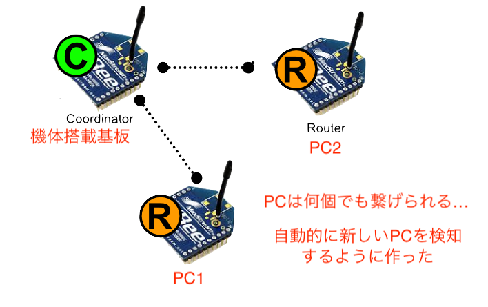

- 受信側はEnd-DeviceではなくRouterにした
    - End-Deviceは定期的にスリープに入り、受信間隔が長くなってしまう
    - 77Byteのペイロードで10〜11Hzのデータ送信ができた (6kbpsぐらい)

#### 2018年度ハードウェア
###### 機体搭載XBee

- XBee－PRO ZB Extended－Range Programmable S2Bモジュール U.FLアンテナ
- 秋月ではもう販売してない
    - 代わりに [XBee ZB S2Cモジュール U.FLタイプ](http://akizukidenshi.com/catalog/g/gM-10071/)とかが使える
        - 通信距離は1500mから1200mになってしまうがそれ以外は同じ
            - S2CのProモデルは 3200m なのでそれが買えるなら断然それが良い
                - 日本で買えそうな場所がみつからないので買うなら[ここ](http://www.digi-intl.co.jp/products/wireless-wired-embedded-solutions/zigbee-rf-modules/zigbee-mesh-module/xbee-zb-module.html)で直接DIGI社に問い合わせるべき
        - [S2C 説明](http://akizukidenshi.com/download/ds/digi/BR_xbee_ZB.pdf)
        - [S2Bモジュールからの変更点](http://akizukidenshi.com/download/ds/digi/XBee_ZigBee_Migration_Guide.pdf)
        - [S2C ドキュメンテーション](https://www.digi.com/resources/documentation/digidocs/pdfs/90002002.pdf)
        - UARTではなくSPI通信を使えば5倍ぐらい通信を高速化できる
            - 10Hz → 50Hz だぞ？(しゅごい)
- Programmableモデル
    - 取扱がめんどくさいので正直後悔
        - 特に理由がない限りProgrammableモデルは使わない方が良い
            - 使いこなせば便利ではある
        - 電源投入後にUART通信で'B'という文字を送れば通常モデルと同じ挙動をする
- アンテナ
    - PCBアンテナ
        - 基板上にアンテナがある
        - 屋根に被せられてしまう
    - U.FL or RPSMA アンテナ
        - 2017年度以前はRPSMAアンテナを採用した
        - 2018年度WASAはU.FLアンテナを採用した
        - フェアの外に突き出させることができる
            - ドキュメンテーション等に記載されている通信距離は何も妨げのない場合の値である
            - できるだけ露出を高めたほうが安定して通信できる

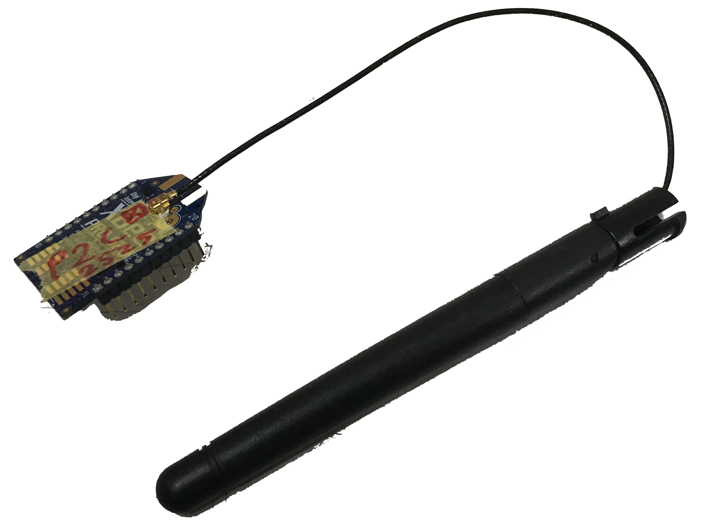

###### PC用XBee

- 上と同様でもう販売していない
    - 今は代わりに[XBee ZB S2Cモジュール RPSMAタイプ](http://akizukidenshi.com/catalog/g/gM-10070/)とかが使える
        - これもProにできるならそうしちゃおう
- こういうアダプタでPCと通信できる
    - [USBドングル](https://www.switch-science.com/catalog/1790/)
    - [mini USB](https://www.switch-science.com/catalog/1791/)

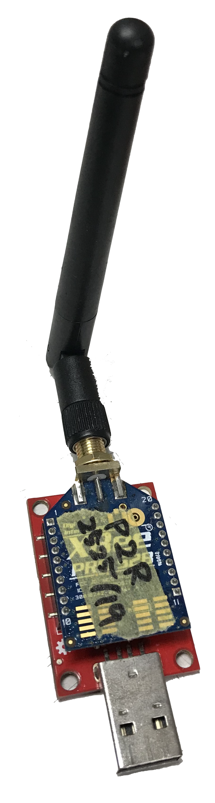

#### XCTU使用方法

##### 初期設定編
- デバイスファームウェアのインストール
	- XBee S2Bモデルのファームウェアは現在のバージョンではデフォルトで入っていないのでインストールする必要がある
	- XBee S2Cだったらこのステップは必要ないかも?

- XCTUを開くと最初はこんな感じの画面が出てくる

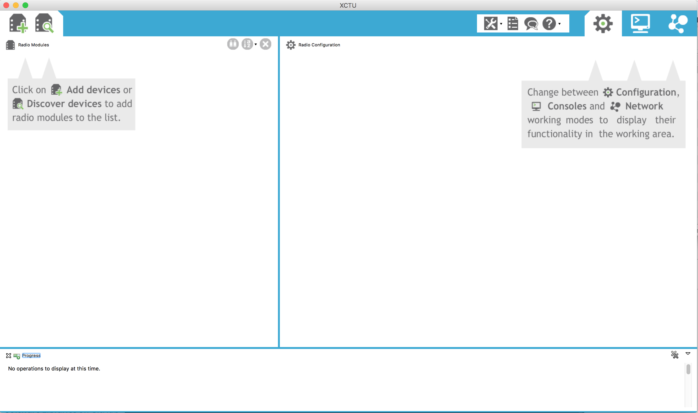

- 以下のように `Tools > Firmware Explorer > Click Here > Install legacy firmware package > OK` という風に操作する
	- これで古いバージョンのファームウェアが全部ダウンロード・インストールされる
	- 時間がかかるのでちょっと待って

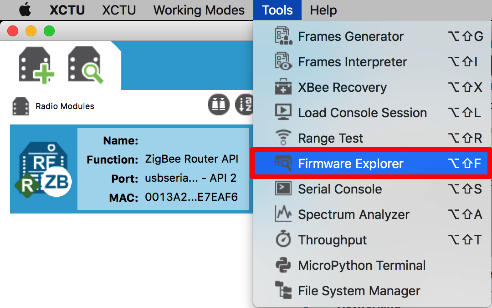

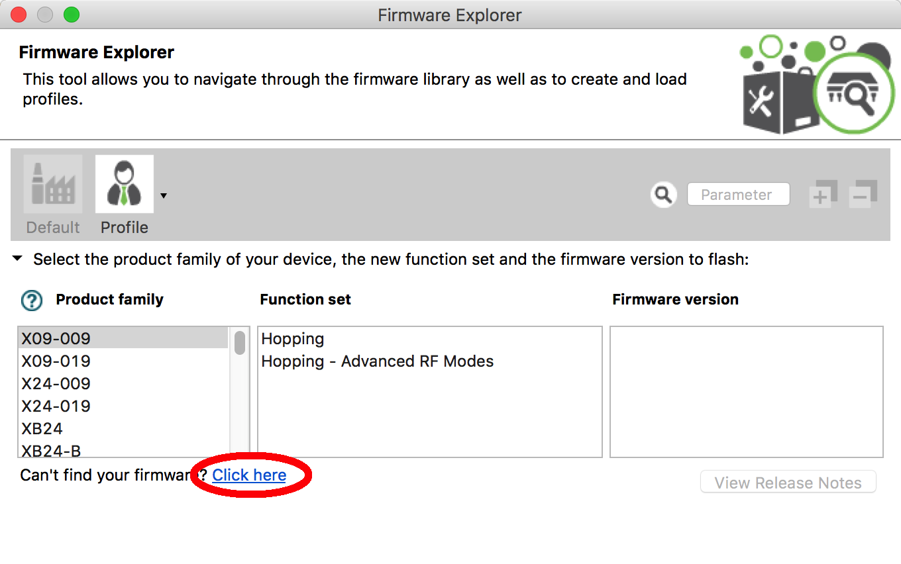

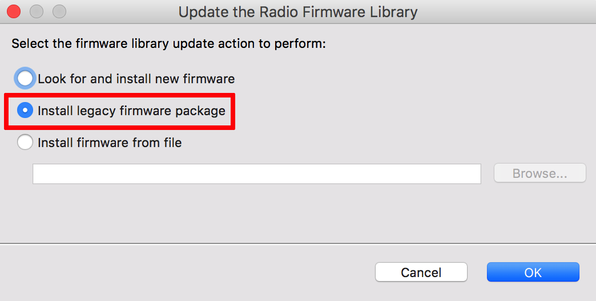

##### XBeeとの接続編

- 左上のデバイス追加ボタンでデバイスを追加することができる
- 隣のデバイス探索ボタンはポート名やBaudrateがわからないデバイスとつながるときに使う

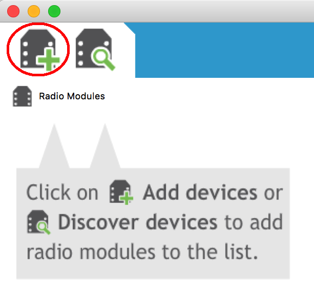

- 次に出てきた画面でデバイスとの通信(無線通信ではなくPCとの通信)のポート名, Baudrate等を設定する
	- 通常のXBeeは購入時に9600bpsである
	- 2018年度WASAでは通信を高速化するために576000bpsに統一した
- Programmableなモジュールである場合は必ず `The radio module is programmable.` 欄にチェックを入れること
- `Finish`を押したら接続が完了する
	- たまにエラーが表示されるので
		- アダプタ上のリセットボタンを押す
			- RPSMAモデルを使ってるとボタンが押しにくいことがあるのでピンセット等を使うこと
			- ピンセット等金属類を使う際は回路がショートしないように気をつけること
		- 設定を再確認する

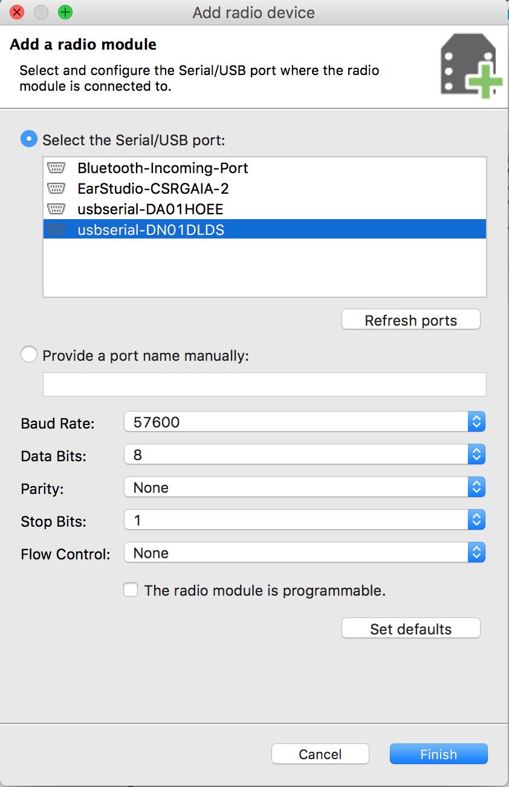

- 接続が完了したら左側の列にXBeeモジュールが表示されるのでクリックしてみよう

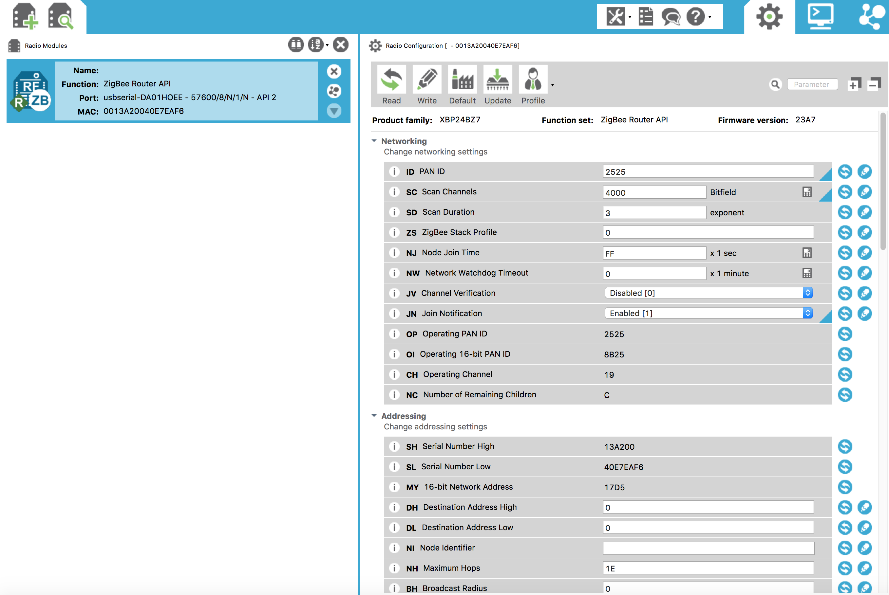

##### ファームウェア更新編
- できること
	- ZigBeeファームウェアの更新
	- 通信モード(AT/API)の変更
	- 役割(Router/Coordinator/End-Device)の変更

- **既に接続されたデバイスでやる場合**
	- `Force the module to maintain its current configuration`欄
		- チェックを入れるとBaudrate等のパラメータは更新後にも引き継がれる
		- チェックがないと各パラメータは全部初期化される

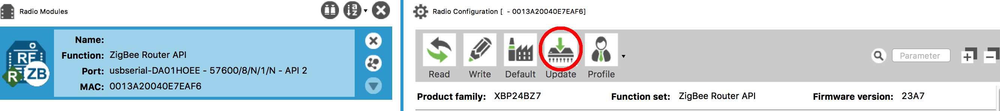
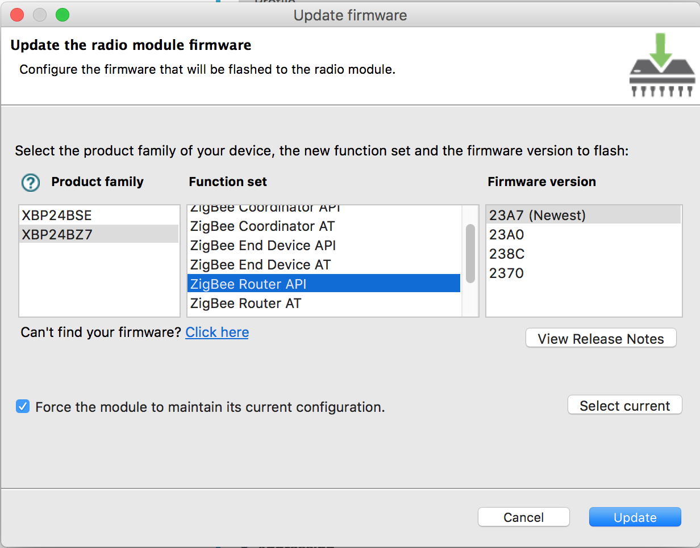

- **未接続のデバイスでやる場合** (接続ができないから初期化したい!という場合とかも)
	- 各パラメータは全て初期化される

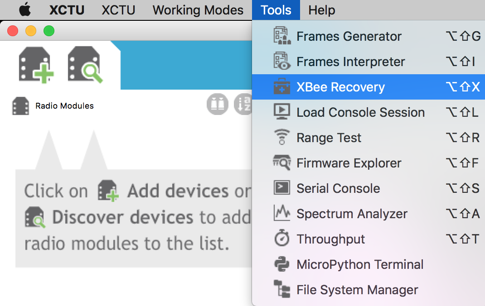
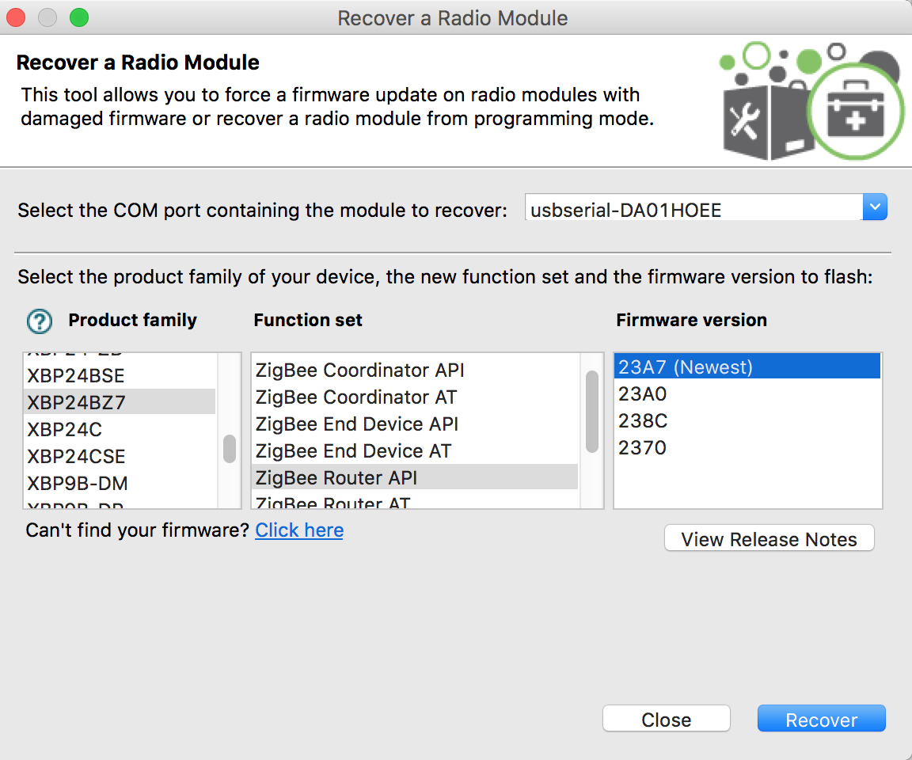

##### ネットワーク構築編

TODO

