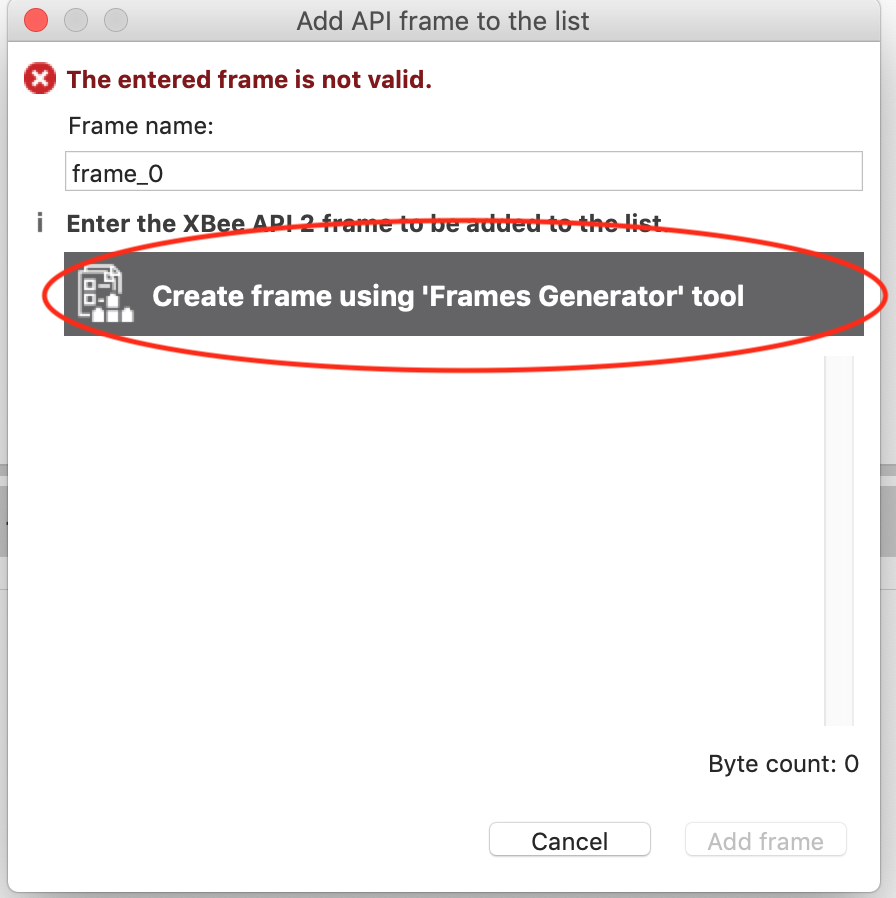

## XCTU使用方法

### 初期設定編
- デバイスファームウェアのインストール
	- XBee S2Bモデルのファームウェアは現在のバージョンではデフォルトで入っていないのでインストールする必要がある
	- XBee S2Cだったらこのステップは必要ないかも?

- XCTUを開くと最初はこんな感じの画面が出てくる

- 以下のように `Tools > Firmware Explorer > Click Here > Install legacy firmware package > OK` という風に操作する
	- これで古いバージョンのファームウェアが全部ダウンロード・インストールされる
	- 時間がかかるのでちょっと待って

### XBeeとの接続編

- 左上のデバイス追加ボタンでデバイスを追加することができる
- 隣のデバイス探索ボタンはポート名やBaudrateがわからないデバイスとつながるときに使う

- 次に出てきた画面でデバイスとの通信(無線通信ではなくPCとの通信)のポート名, Baudrate等を設定する
	- 通常のXBeeは購入時に9600bpsである
	- 2018年度WASAでは通信を高速化するために576000bpsに統一した
- Programmableなモジュールである場合は必ず `The radio module is programmable.` 欄にチェックを入れること
- `Finish`を押したら接続が完了する
	- たまにエラーが表示されるので
		- アダプタ上のリセットボタンを押す
			- RPSMAモデルを使ってるとボタンが押しにくいことがあるのでピンセット等を使うこと
			- ピンセット等金属類を使う際は回路がショートしないように気をつけること
		- 設定を再確認する

- 接続が完了したら左側の列にXBeeモジュールが表示されるのでクリックしてみよう

### ファームウェア更新編
- できること
	- ZigBeeファームウェアの更新
	- 通信モード(AT/API)の変更
	- 役割(Router/Coordinator/End-D
	evice)の変更

- **既に接続されたデバイスでやる場合**
	- `Force the module to maintain its current configuration`欄
		- チェックを入れるとBaudrate等のパラメータは更新後にも引き継がれる
		- チェックがないと各パラメータは全部初期化される

- **未接続のデバイスでやる場合** (接続ができないから初期化したい!という場合とかも)
	- 各パラメータは全て初期化される

### ネットワーク構築編

- Coordinator の初期設定
	- 参考: https://www.digi.com/resources/documentation/digidocs/PDFs/90000976.pdf#page=41
	- Coordinatorは以下の4つのパラメータを互いに合わせないと予備としもう一つ発動する際には動かなくなる
		- OP
		- OI
		- CH
		- ZS
	- OIの値だけ書き換えるのがめんどい

OIを0x4545から0x8B25に変えたい場合

1. XCTUでZigbeeがつながった状態にする

2. ターミナルタブを押す

3. パケット監視をOPENする

4. フレームを作る

5. フレームエディタを開く

6. フレームを設定してOKを押す

- Frame Type 
	- 0x09 - AT Command Queue Register Value
- AT Command
	- ASCII
		- II <- アイアイね
- Parameter Value
	- HEX
		- 8B 25

7. フレームの確定と送信

8. 設定モードに戻って OI 欄の右にある更新ボタンを2回ぐらい押して変わってたらOK!
	- だめだったら人生諦めて

TODO

